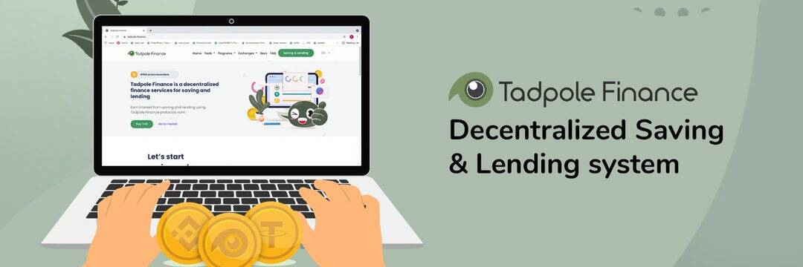

# Tadpole Finance

Tadpole Finance 是一个 DeFi 借贷协议。 用更专业的术语来说，它是一种算法货币市场协议。 你可以把它想象成一个开放的金钱市场。 Tadpole 与其他 DeFi 项目的区别在于，任何人都可以使用 Tadpole 将任何 ERC-20 代币注册到借贷协议中。 一旦代币在市场上注册，人们可以将一些存款发送到协议中以赚取利息，或者通过放置某些抵押品并支付一些利息来借入代币。

一个为存贷提供 DeFi 服务的开源平台 || 加入我们的国际电报讨论组：http://t.me/TadpoleFinance

