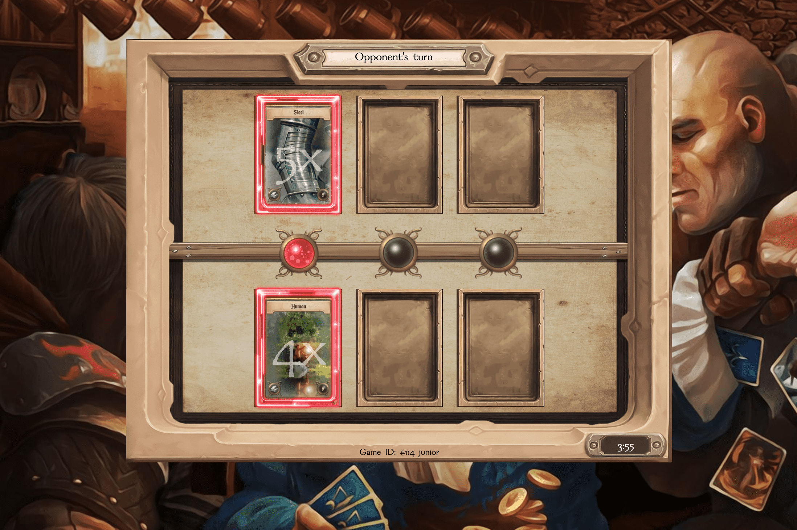

# TaleCraft

Avalanche TaleCraft 上的第一款手工艺游戏是一款 PVP 即赚钱纸牌桌游，由独特的铸币厂和工艺机制驱动，玩家通过游戏化的 NFT 炼金术变得更加强大。元素基础卡每周出售，只有最熟练的炼金术士才能在这个中世纪的虚拟世界中茁壮成长。所有 NFT 持有者都将获得游戏生态系统产生的 AVAX 收益，奖励最忠诚和最熟练的持有者。NFT 和通证通货紧缩系统 TaleCraft 利用一种全新的 NFT 铸造过程来平衡游戏设计和稀缺性，旨在产生可持续的、长期的长期经济。 Crafting Technology 通过将稀缺性与博弈论结合起来，通过燃烧基础卡来制作更高级别的卡来实现这一点。此外，当使用 $CRAFT 打开宝箱时，它们会被烧毁并用于重要的流动性——支持整个游戏经济。 NFT 的总供应量将由自由市场原则驱动的社区需求决定和平衡。
开源手工艺技术 TaleCraft 利用 ERC-1155 协议，手工艺系统植根于本规范中可用的功能。任何项目、合作伙伴或艺术家都可以利用该系统来生成由实际需求驱动的可持续 NFT 经济，而不是任意数字。
棋盘游戏 TaleCraft 的“游戏赚钱”棋盘游戏模式让玩家可以正面交锋，测试他们的技能并展示他们的炼金术和精心制作的力量的力量。这是一种引人入胜的游戏体验，在一场全面的中世纪战斗中将 NFT 工艺和经济带入生活。成功的胜利者将获得由游戏协议生成的 AVAX 奖励。

