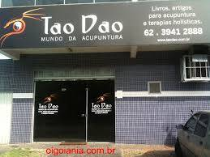

# Tao Dao

什么是陶？
DeFi 资产管理生态系统
TaoDAO 是一个由 DAO 管理的生态系统，将提供一整套产品和服务。
无需许可的去中心化资产管理。以用户体验为重点，将专业基金经理与投资者联系起来。
TaoDAO 是一个由 DAO 治理的生态系统，专注于去中心化资产管理。
我们努力为更广泛的 DeFi 生态系统提供自由和可访问性。建立在 L2 仲裁和乐观之上
资产经理
专注于易用性和直观的设计。利用您的技能，使用期权、衍生品和指数等多种产品在任何市场条件下产生回报。管理费和绩效费完全由您设定。
投资者
我们为创造被动收入提供简单透明的解决方案。深入了解基金经理如何运作他们的投资。
陶
Tao 提供了一个无需信任的系统来连接资产管理者和投资者。 TAO 代币将通过为访问我们的服务和产品而收取的 DAO 管理费用创造价值。

