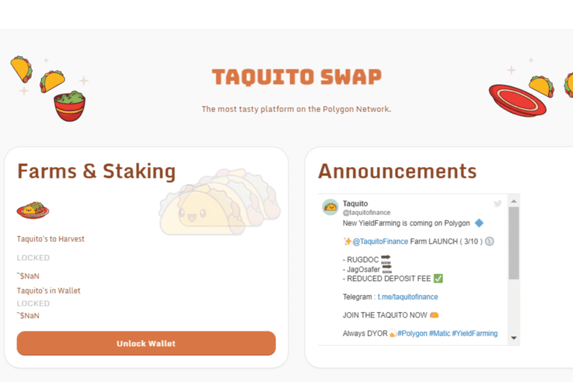

# Taquito Finance

一个多层去中心化的收益农场交易所，运行在 Polygon 链上； PancakeSwap 的一个叉子。
这是我们公司未来的第一个收益农场项目，因此我们承诺始终与投资者和社区保持透明和沟通。 建设性的反馈和建议非常受欢迎。 我们感谢您的信任，并将努力继续开发和改进这个项目。

在 Polygon 链上运行的多层去中心化收益农场交易所。

什么是塔基托金融？
一个多层去中心化的收益农场交易所，运行在 Polygon 链上； PancakeSwap 的一个叉子。

这是我们公司未来的第一个收益农场项目，因此我们承诺始终与投资者和社区保持透明和沟通。 建设性的反馈和建议非常受欢迎。 我们感谢您的信任，并将努力继续开发和改进这个项目。

