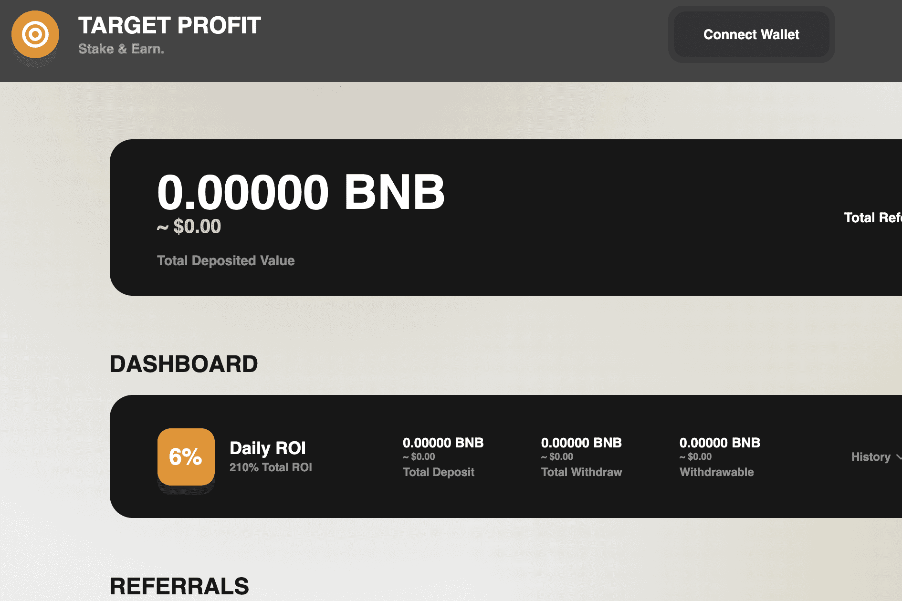

# Target Profit

Target Profit 是币安智能链上的一个新的收益农场，每日固定稳定收益为 6%。
最低存款为 0.05 BNB，没有上限。
我们提供标准的 5 级推荐计划，8% - 3% - 2% - 1.5% - 0.5%
分秒必争。 210% 的总投资回报率。
立即加入，不要错过这份合同！

Target Profit 是一个 BNB 收益农场平台，可为您提供 6% 的固定每日回报。目标利润统计
该数据代表被跟踪智能合约的原始链上活动高级数据
查看更多深入分析

