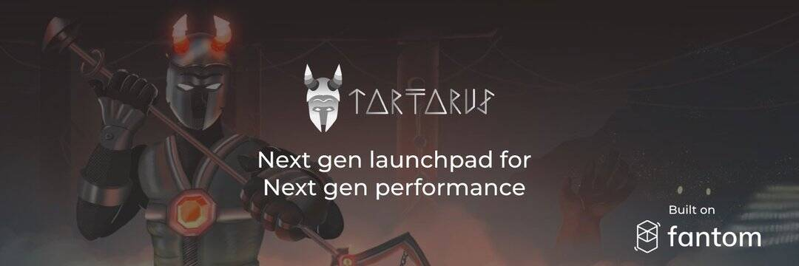

# Tartarus Finance

Tartarus 是 Fantom 区块链上 IDO 的去中心化筹款平台。 为了为寻求早期访问 DeFi 中经过审查的项目的投资者提供一个简单易用的平台，Tartarus 在这里通过以公平和智能的方式提高流动性来增强基于 Fantom 的项目，并为他们发展忠诚的社区。 Tartarus 通过民主化分配和公平启动将传统风险投资的能力扩展到任何人。
Tartatus 由具有技术和金融科技背景的团队和顾问开发，并得到庞大的社区和 KOL 网络的支持，为项目提供所有工具和资源，确保 IDO 成功启动。

