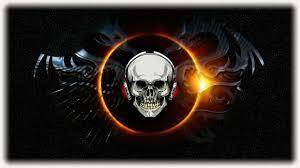

# TattooInkToken

纹身令牌是币安智能链令牌。 专为纹身用户开发。 Tattoo 是一个开源的点对点数字代币，交易手续费低。 每个纹身用户都可以使用 tatoo 代币进行纹身付款，并且用户可以在任何 BSC DEX 交易所兑换纹身代币。 例如：Pancakeswap。 全球纹身用户日益增加，因此纹身代币用户也随着全球市场的增长而增长，这将有助于提高纹身代币的价格。

TattooInkToken充分利用了区块链的力量，是基于BSC区块链上的NFT+元宇宙的游戏，任何人都可以玩。 任何新玩家都可以赚取游戏代币BSC在虚拟世界中消费或交易。
NFT 是一种非同质化的代币，NFT 提供了一种解决版权问题的新途径：当一个作品被铸造成 NFT 链时，它被赋予了一个不可篡改的唯一代码。 无论作品被复制和传播多少次，原作者仍然是作品的唯一所有者。 在区块链的帮助下，玩家可以创造稀有的虚拟物品并确保它们的稀缺性。 游戏中的资产是绝对真实的，TattooInkToken是一个很好的赚钱工具。
TattooInkTokentokens 是 BSC，是在区块链上铸造的虚拟代币。

