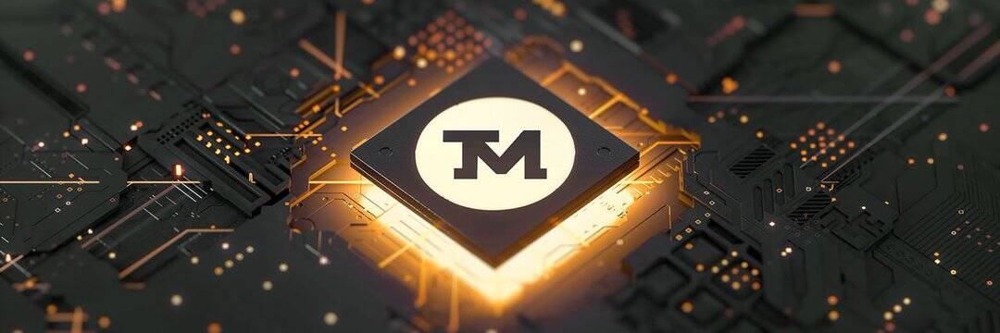

# TattooMoney

纹身钱 TAT2
TAT2 代币是为全球纹身行业打造的通缩多区块链代币。 它允许在 NFTattoo 平台上收集和转移金融资产、支付纹身工作室的服务费用以及交易 NFT。 此外，TAT2 持有者将有可能在去中心化加密货币交易所进行质押、增加流动性或参与空投。💥看看这个由我们的合作伙伴 Dumitru Todirica 制作的令人惊叹的逼真纹身，他是曼海姆 Mirel 纹身工作室的老板🇩🇪

🤩看看台北纹身展的精彩！ 我们周末都在台湾参加一个很棒的纹身大会。

如果你明天参加活动，请过来打个招呼👋

