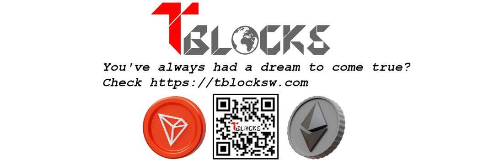

# TBlocksW

TBlocksW 是 TRON 区块链上第一个拥有酷炫角色的 3D NFT 收藏项目。 TRC-721 TBlocks旨在成为TRON的NFT革命并创造TRON NFT世界！ 总共有 20.000 个 TBlock。 所有 TBlock 都是随机铸造的。 它们还具有许多定义 TBlock 稀有性的属性。 TBlocks 将在市场上上市并在独特的 GameFi 世界中使用。 祝所有将铸造他稀有的 TBlocks 和#HODL 以取回被动收入的人好运。

⏳ ETH-Bridge 几乎准备就绪

ETH 区块链上的有限免费薄荷

所有将在#TRON 上铸造#Tblocks 的用户也将能够在以太坊上免费铸造它们。

现在薄荷：http://tblocksw.com

