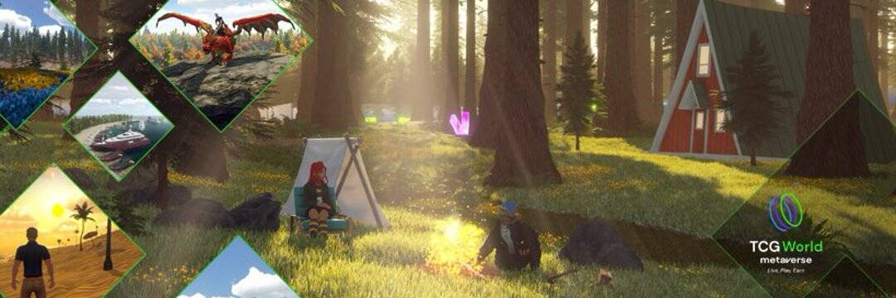

# TCG World

TCG World 是最大的开放世界 MMORPG 区块链元界，玩家可以在其中赚取 TCGCoin 2.0、收集 NFT 收藏品、拥有虚拟房地产、创建、探索游戏世界、控制自己的业务或只是玩得开心。
TCG World 为 NFT 引入了一种新方法，使其不仅仅是一件艺术品——现在玩家可以将他们的 NFT 带入虚拟游戏世界并进行游戏。玩家在元宇宙中拥有的一切都是 NFT——不动产、车辆、宠物、奖杯，甚至是玩家头像。
#LIVE 在广阔的虚拟世界中，分为 4 个独立的区域，由 100,000 个“地块”虚拟土地组成。
#播放独一无二的故事情节，探索 800 平方公里的壮丽景色。完成挑战和任务。结交新朋友！
#EARN TCG2 通过狩猎水晶、质押 TCG2，将您的创作、创意和艺术货币化。建立业务等等！
#收集稀有生物，发现文物和文物。收集你最喜欢的头像、宠物和可坐骑。访问 NFT 艺术市场！
#BATTLE NFT Sprites ''一款受口袋妖怪启发的 NFT 可收藏区块链冒险游戏'' 发现一个充满由人工智能驱动的神秘 Sprites 的世界。
TCG Worlds 的原生货币是 TCGCoin 2.0。 TCGCoin 2.0 提供跨链转账功能，通过内置TCG 金融生态系统的简单跨链交换，通过不同链上TCG 项目的主钱包，用户可以在不同区块链上的智能合约之间转移代币的价值。

