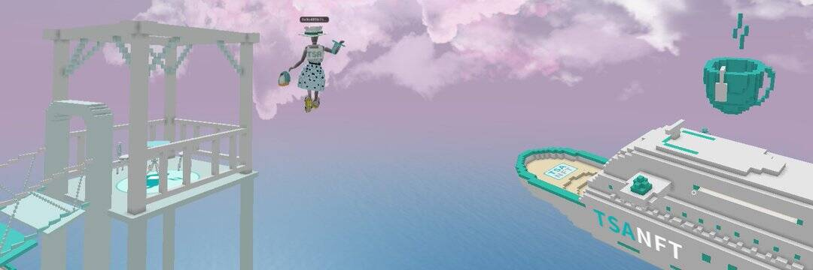

# TEAsWAP.ART Token

茶交换。 Art（“TSA”）现在是您欣赏令人难以置信的创新 NFT 艺术的家园。我们邀请您一起潜入这个数字启蒙的新时代。
TSA 是一个新的数字 NFT 艺术跨链市场，建立在币安智能链和以太坊网络之上，由原生治理令牌 TSA 和 DeFi 解决方案提供支持。
TSA 将世界各地的创作者、收藏家、策展人、影响者、经纪人、钱包、拍卖师聚集到 NFT 数字空间。目前拥有 3 个空间：NFT Broadway、NFT Incubator 和 NFT Finance。 TSA NFT Finance 可以通过将 NFT 和 DeFi 合二为一来提供独特的功能，并允许 NFT 收集者产生农场和权益。

TSA Collections 正在将由区块链技术驱动的艺术和时尚世界整合到 NFT 数字空间中。每个以 NFT 为代表的收藏都包含一个独特的艺术故事。通过收集 NFT，用户可以将完成的 NFT 兑换为实物艺术品。

创建 TSA 的目的还在于赋予 TSA 社区影响决策和激励积极参与的权力，例如 RARI，并为创作者和收藏者提供就平台升级和社区发展提出建议的机会。

TSA Top 3 Collections 为 CaoJun CJAI 限量版 NFT Collectibles 、Peter Blake 限量版。 Gus Bawab 和 Emmanuel Robbe 限量版。 TSA 收藏还与其他 NFT 市场合作，例如 OpenSea 和 BakerySwap

TSA 为 TSA 社区内的不可替代代币 (NFT) 和两种加密货币提供收益农业机会。

