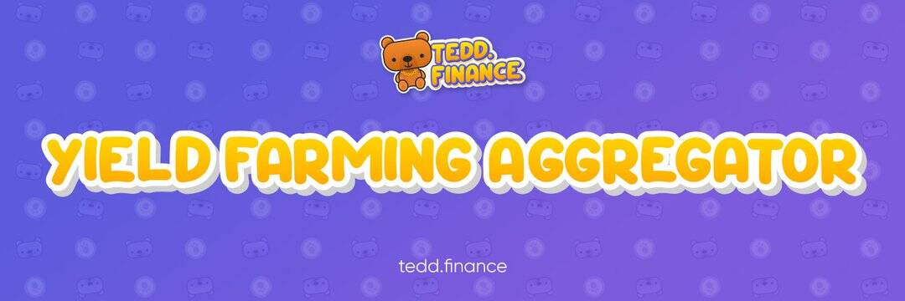

# Tedd Finance

Tedd.Finance 是运行在 Polygon (MATIC) 链上的 DeFi 农业 + 区块链游戏协议。 该项目旨在将所有高利润的农业机械师连接到最便宜和最快的网络上的一步式收益农业聚合器。
重要提示👇🏻
✔️Polygon (MATIC) 网络gas费几乎为零
✔️链上农场和链上加密游戏
✔️巨大的闪电贷款协议聚合器：QuickSwap、Sushi、Curve、Aave
✔️促进营销

🔥所有剩下的TEDD很快就会被烧毁🐻

💎http://Tedd.Finance 部署了新的不可升级的智能合约，但操作逻辑保持不变

🔒我们还添加了新的游泳池！ 

