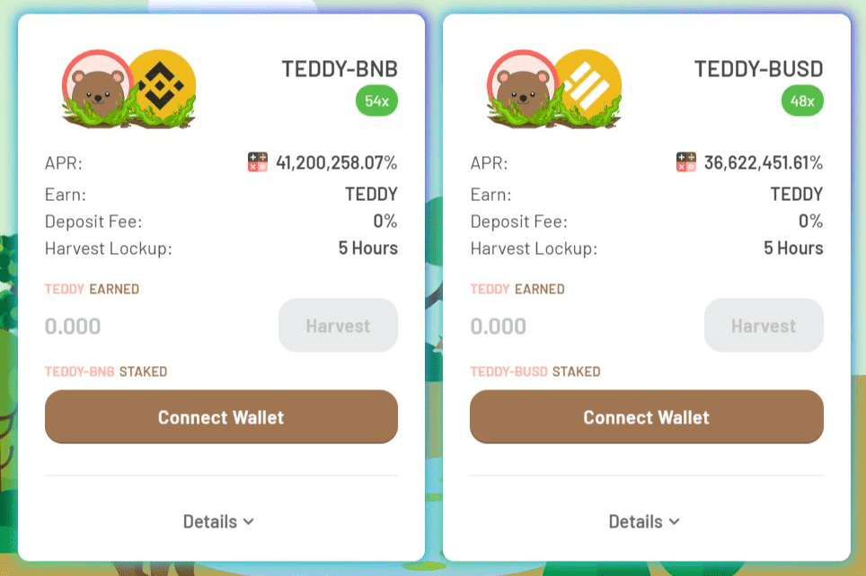

# TeddyDefi

TeddyDefi 是由 BSC、Polygon 和 Avalanche 支持的即将推出的可持续去中心化收益农业和收益聚合协议。 我们的重点是为愿意支持我们成为可用的最佳 DEFI 协议之一的投资者提供安全的收益农业体验。
从投资者的角度来看，尽早找到一个好的项目进行投资非常重要，因为这样可以获得更高的回报。 尽管大多数加密投资者都知道加密市场所涉及的风险高于股票和其他投资选择。 因此风险和回报率也很高。 然而，最近机构投资者对投资这个市场非常感兴趣，大多数国家也在试图规范这个市场。
我们的愿景是在 BSC Polygon 和 Avalanche 网络上创建一个不断发展的协议，让开发者和投资者共同成长

