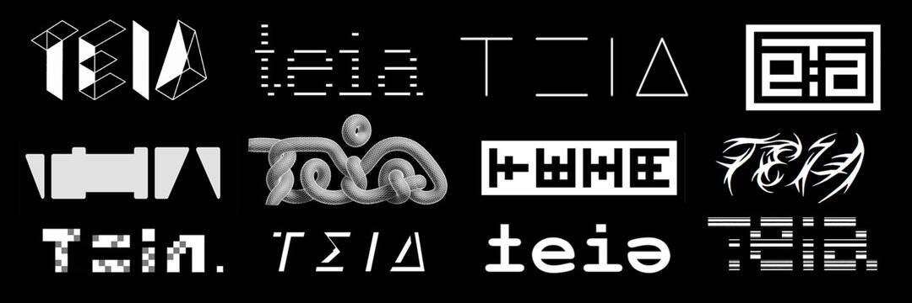

# Teia

蒂亚是...
... 由艺术品组成的协作艺术品，是思想和创意作品的场所。
... 一个非营利性的开源在线平台，用于将数字资产作为 OBJKT NFT 进行交易。
... 一个集体，在可持续性、可访问性和公平的价值观下保持一致。
... 由其社区拥有和维护，由其参与者建造和改进。
Teia 是并将永远是一个正在进行中的工作。

🚨铸币问题🚨快速提醒一下，Teia 上的铸币目前无法正常工作。开发团队已经意识到并且几乎可以推出修复程序。请耐心等待，铸币很快将再次可用。

