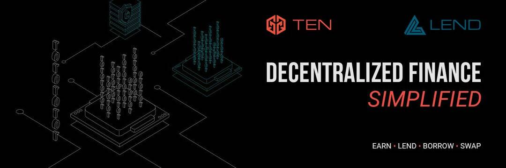

# TEN Finance

TEN 是一个收益聚合器/优化器，它通过可用的最具流动性的币安智能链流动性池来简化 Staking 和收益耕作，并在市场上提供强大的收益赚取环境，同时适应不同池的日常流动性需求。 TEN 是 Token Enrichment Network，去中心化金融，简化！
总体而言，DeFi 空间对许多人来说可能非常繁琐且令人困惑，尤其是对于我们这些对 DeFi 不熟悉但不一定对加密货币本身不熟悉的人而言。
在这个单产农业繁荣的狂野西部，那里有很多人，不知道该信任谁和信任什么，TEN 致力于仅聚合和优化我们认为对我们的用户具有最高水平的农场平台。
TEN 旨在通过创建一个无缝且精简的流程来简化这一过程，以最简单和最安全的方式将您的资产质押以赚取高回报但适度的 APY，同时确保 TEN 平台内跨多个农业生态系统的可持续增长并优化回报以实现最大收益一种安全、可持续和稳健的方式。
TEN 的推出是为了创建一个真正可持续但有益的模型，以确保 TENFI 生态系统的长寿，从而使 TEN 能够适应和发展整个 DeFi 空间。这提供了高收益机会，并确保 TENFI 生态系统继续发展和适应。 TENFI 旨在成为去中心化金融的先锋。

