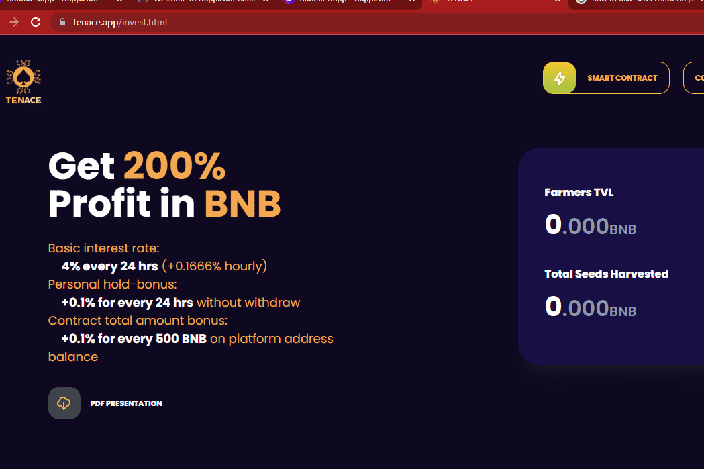

# Tenace

使用 Tenace 的产品 Tenace Farm 在 BNB 中赚取 200% 的利润。
4%的基本每日利息。
每 24 小时 +0.1% 霍德尔奖励。
最大利润 200%。
最小投资：0.1BNB。
最大投资100BNB。
每日最大提款10BNB。
每 500 BNB TVL +0.1%。
由 SolidProof 和 Solidity Finance 审计。 完整报告在我们的网站上。
5% 推荐奖金。

坚韧的定义一手同花色的两张高牌或相对高牌（如 A 和 Q）的组合，其中一张比另一张低 2 度

名词惠斯特，桥。一系列相同花色的两张高牌，没有中间牌以连续顺序排列，如 A 和 Q。

