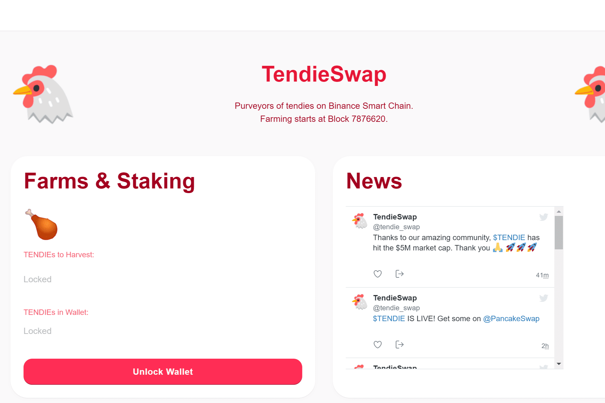

# TendieSwap

什么是 TendieSwap？
除了提供我们自己的 DEX、质押和农业协议外，TendieSwap 还专注于彻底改变博彩行业。
TendieSwap 是一种非托管预测协议，使用户能够在高收益预测市场上获得无限奖励。 TENDIE ($TENDIE) 是 TendieSwap 生态系统的实用代币，基于 BEP-20 代币标准。
TendieSwap 预测：一种工具，可让您根据您认为某些代币的价格走向来赚钱。因此，例如，如果您认为 BNB 将在 5 分钟内高于 640 美元，那么您可以下注并从您的理论中赚钱。
TendieSwap Lottery：用 TENDIE 购买彩票，贡献彩票。如果您的票号中有 2、3 或 4 个与中奖号码及其确切顺序相符，则赢取奖品！
TendieSwap 是预测市场的新 GOAT。我们将提供自动做市算法，使用户能够创建具有集成选项和定价计算的自动预测市场。稍后，用户将能够设置自己的赌注并让其他人站在另一边。
真正的去中心化投注已启用！

