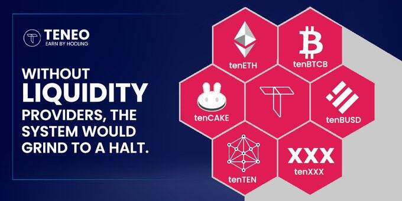

# Teneo DAPP

Teneo 是一种基于挂钩代币交易的多层收益生成协议。 用户可以将代币换成十个代币，并开始赚取交易活动产生的费用。 交易者和套利者可以从十个代币之间的价格偏差中获利。 十个代币的流动性提供者赚取 Teneo，这是为协议提供动力的代币。

你好 Teneo Fam 👋我们一直在努力改进和构建更好的 Teneo 协议版本。关于 Teneo V2 发布的更新：几乎所有代币的测试都已完成，我们的开发人员目前正在开发新的质押功能。

