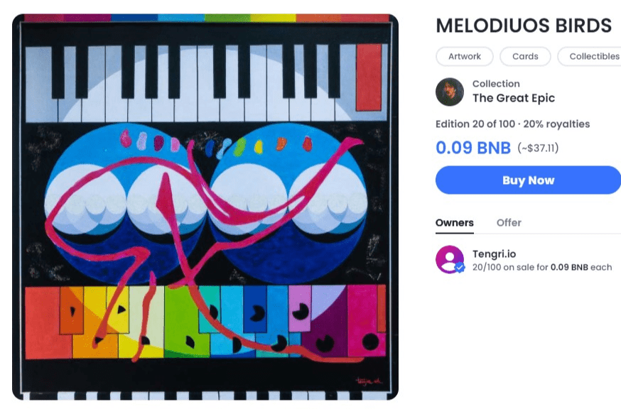

# Tengri.io

NFT 世界是一种资产类别，在短时间内出现了巨大的增长。两年前，只有 545,000 个钱包在交易 NFT，但到 2022 年初，这个数字预计将增加到 3000 万。

NFT世界中钱包参与度的增加无疑增加了市场的交易量。目前，NFT 市场总规模超过 1800 万个 ETH，即估值 540 亿美元，分析师预测 2030 年将达到 3500 亿美元。

随着所有这些大卖的进行，一个重要的问题是，“谁在购买这些 NFT？”

通过回答这个问题，NFT 的创造者和品牌可以了解他们的理想客户是谁。当然，并不是每个人都购买 NFT，甚至都考虑这样做。

通过了解购买 NFT 的人，您将了解在创建和推广 NFT 时使用哪些类别和渠道。

如果您是 NFT 创建者或 NFT 目标品牌，则此内容可以深入了解您的理想客户以及吸引他们的 NFT 类型。

