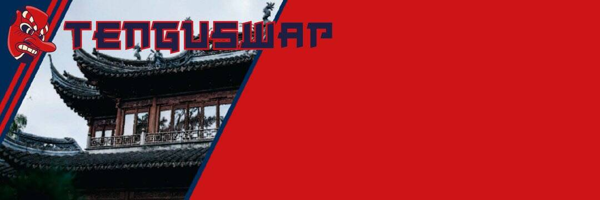

# TenguSwap

8 月 23 日：预售开放 48 小时（区块 #18315007）
8 月 26 日：交易所启动（区块 #18444607）
8 月 29 日：农业启动（区块 #18574207）
8 月 30 日：第一次祝福发布（区块 #18617407）
TenguSwap 不是你通常的豹叉农场。除了通常的自动流动性和销毁之外，我们还实施了一项特殊功能，这将使投资者受益匪浅。所有用户都有机会将他们的 TENGU 换成 GTENGU，这是一种无法购买的真正投资者代币。 GTENGU 将享有 GTENGU 持有者独有的福利，例如赚取 BUSD/BNB、GVaults、合作伙伴等。
✔️ 安全
安全是我们的首要任务，这就是为什么我们决定选择顶级审计公司 Paladin Blockchain Security。 Paladin 是 RugDoc.io 的首选审计师，我们已在发布前对所有合同进行了全面审计。
✔️ 路线图
我们的 TenguSwap 路线图已经制定了 2021 年全年。我们打算并将保留我们网站上的每一个路线图，用户将能够期待 GVaults、治理和扩展到其他链。拥有一个核心团队与内部开发人员一起确保我们将保持这一里程碑。
✔️推荐计划
已实施链上推荐计划，以激励用户邀请朋友加入农场。邀请者可以永久赚取他/她朋友收入的 4%。
概括
我们希望在我们的社交渠道中见到您，我们的管理员和开发人员非常乐意回答您的任何问题。

