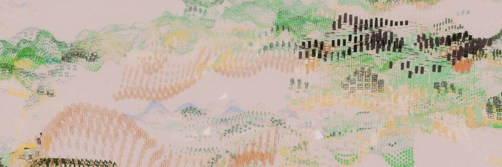

# Terraforms by Mathcastles

关于 Mathcastles 的 Terraforms
Mathcastles 的 Terraforms 是来自动态生成的链上 3D 世界的 11,000 个链上大地艺术 NFT 的集合。

Terraforms 由 @0x113d 创建 || Mathcastles 和@xaltgeist，他们的目标是低调和公平地推出超链上的艺术品。

每个 Terraform 都可以成为链上生成的迷你应用程序绘画程序，然后可以成为链上 1/1 的艺术品，如果持有者将绘图永久地转化为作品。 将整个系列拼凑在一起就构成了一个巨大的 3D 超级城堡。

这些元界艺术作品不是社交 3D 世界，而是永久存储的数据，可通过允许创造性使用的许可证对特定视觉呈现进行解释。

