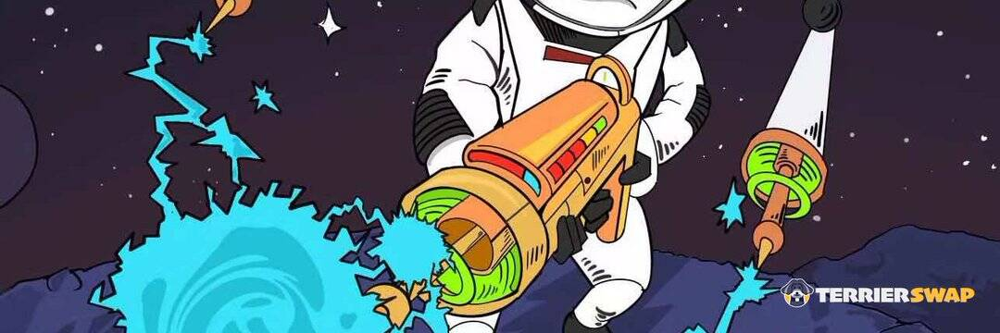

# TerrierSwap

TerrierSwap 是建立在币安智能链上的自动做市（AMM）去中心化交易所（DEX），也是有史以来第一个带有前所未有的 NFT 游乐场：Astroworld 的 DEX。
该交易所允许任何人以低廉的费用立即与流动资金池进行交易。与其他 DEX 相比，我们整洁的智能合约最大限度地利用了资金，大大提高了交易效率，最终减少了流动性提供者的无常损失。
TerrierSwap 使用 TES 代币启动，该代币用作治理代币。团队非常重视并希望实现去中心化的社区治理。随着发展的推进，TerrierSwap 的治理将逐渐转移到 TES 持有者手中。在 TerrierDAO 系统中，TES 持有者可以根据持股权重投票决定日常运营、矿池比例、Astroworld 的 NFT 铸造等。 TerrierSwap 的最初目的是建立一个娱乐和收益的 NFT 游乐场。

