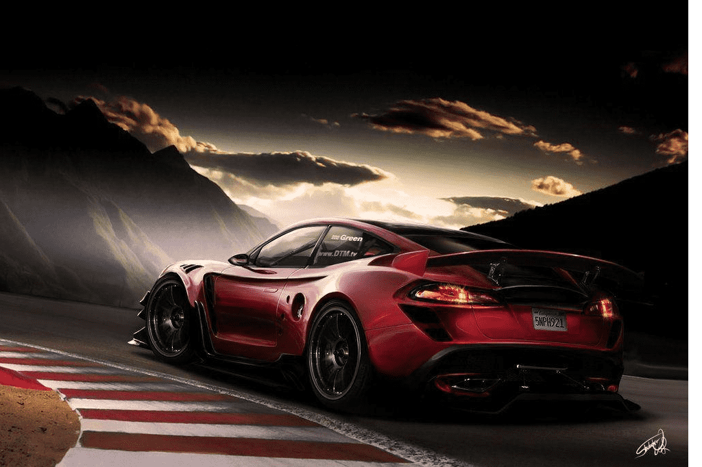

# TESLA200

**新能源车**，或称**替代燃料车**（Alternative fuel vehicle），是指采用非常规的车用燃料作为动力来源（或使用常规的车用燃料、采用新型车载动力装置），综合车辆的动力控制和驱动方面的先进技术，形成的技术原理先进、具有新技术、新结构的车辆。新能源车包括五大类型：[混合动力电动汽车](https://zh.m.wikipedia.org/wiki/混合动力电动汽车)（HEV）、[纯电动车](https://zh.m.wikipedia.org/wiki/纯电动车)（BEV，包括太阳能车）、[燃料电池](https://zh.m.wikipedia.org/wiki/燃料电池)电动车（FCEV）、增程式电动汽车（REEV）[[1\]](https://zh.m.wikipedia.org/zh-hans/新能源车#cite_note-1)、其他新能源包括[机械能](https://zh.m.wikipedia.org/wiki/機械能)（如[超级电容器](https://zh.m.wikipedia.org/wiki/超级电容)、[飞轮](https://zh.m.wikipedia.org/wiki/飞轮)、[压缩空气](https://zh.m.wikipedia.org/wiki/压缩空气)等高效储能器）车等与非常规的车用燃料指除[汽油](https://zh.m.wikipedia.org/wiki/汽油)、[柴油](https://zh.m.wikipedia.org/wiki/柴油)之外的燃料，如[天然气](https://zh.m.wikipedia.org/wiki/天然气)（NG）、[液化石油气](https://zh.m.wikipedia.org/wiki/液化石油气)（LPG）、[乙醇](https://zh.m.wikipedia.org/wiki/乙醇)汽油（EG）、[甲醇](https://zh.m.wikipedia.org/wiki/甲醇)、[二甲醚](https://zh.m.wikipedia.org/wiki/二甲醚)。[[2\]](https://zh.m.wikipedia.org/zh-hans/新能源车#cite_note-2)[[3\]](https://zh.m.wikipedia.org/zh-hans/新能源车#cite_note-3)另外有一些冷门的方案，如[斯特林发动机](https://zh.m.wikipedia.org/wiki/斯特林发动机)和六[冲程](https://zh.m.wikipedia.org/wiki/冲程)[内燃机](https://zh.m.wikipedia.org/wiki/內燃機)等增加燃烧效率的设计，甚至[太阳能](https://zh.m.wikipedia.org/wiki/太陽能)或[核能](https://zh.m.wikipedia.org/wiki/核能)等。

在车辆历史的早期曾有很多使用汽油或柴油以外的能源的方案，或者有些可以用汽油或柴油但不用内燃机，可是因为这些车的成本效益低而被淘汰。在二十世纪七十年代起复兴这类车，提倡新能源车是为了应付[环保](https://zh.m.wikipedia.org/wiki/環保)和[石油危机](https://zh.m.wikipedia.org/wiki/石油危機)需要，需要减少或放弃燃烧传统的汽油或柴油驱动[内燃机](https://zh.m.wikipedia.org/wiki/內燃機)的现时主流车型。

