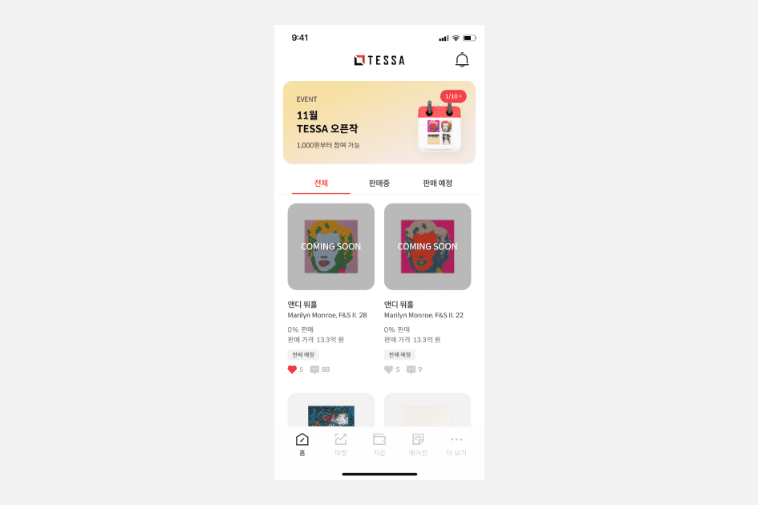

# TESSA

TESSA 是一个另类投资平台，用于购买、出售和交易投资级蓝筹艺术品的分散所有权权益，具有公开市场的可访问性和流动性欢迎使用商标电子检索系统 (TESS)。 该搜索引擎允许您搜索 USPTO 的注册商标数据库和先前未决申请的数据库，以查找可能因混淆拒绝而阻止注册的商标。

警告：在进行搜索之前，您必须了解以下内容： (1) 数据库包含哪些内容； (2)如何构造一个完整的搜索； (3) 如何解释搜索结果。 单击 TESS TIPS 以获取有关这些和其他重要搜索主题的详细信息。
如果查看搜索结果时没有出现标记图像，请清除 Internet 浏览器中的缓存。 如果您需要清除缓存的详细说明，请联系 tess@uspto.gov。 谢谢你。

