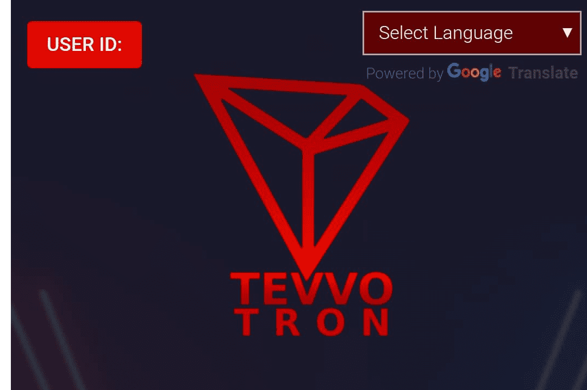

# TevvoTron 2.0

TevvoTron 2.0 - 是一个完全 100% 去中心化的众筹和众包国际平台，也是第一个在 Tron 智能合约中设计的系统，旨在为每个人提供基于 TRX 区块链技术的独立财务基础。 通过将TRX存入合约地址，您将获得300%返还保证收益，分配将根据智能合约算法自动处理。 该算法执行在社区成员之间分配会员佣金和遵守某些条件（营销计划）的功能

TevvoTron 2.0 统计数据该数据代表被跟踪智能合约的原始链上活动

