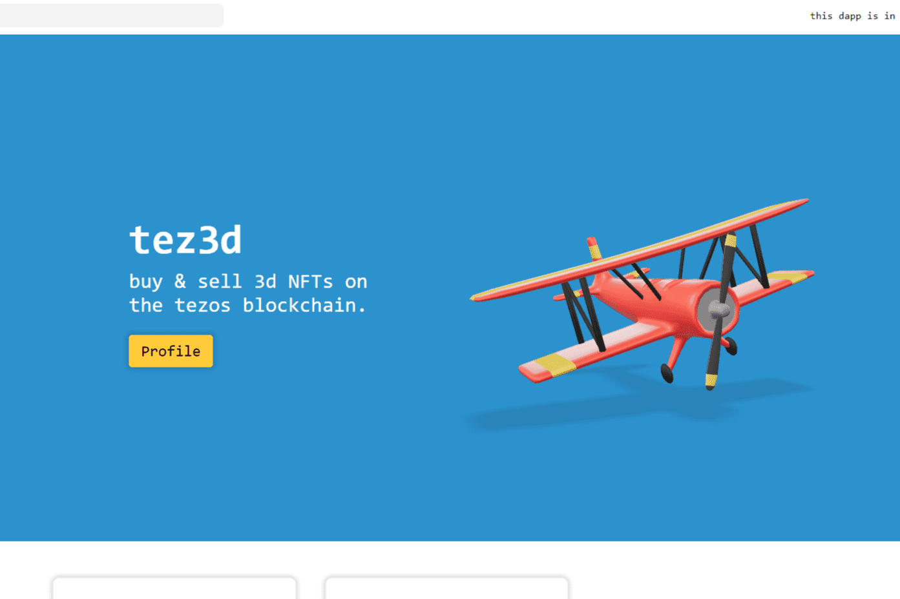

# tez3d

在 Tezos 区块链上铸造、销售和购买 3D NFT！
每个 NFT 都以 .glb 文件的形式存储在 ipfs 网络上，可以在 3D 软件中使用。

op 3D NFT 值得投资
三维 NFT 类别包含在当今最流行的 NFT 类型列表中。 它们有很多用途和效用，尤其是在数字世界中。 3D NFT 可以整合到大多数支持元节的视频游戏中。 它们还可以用作虚拟和增强现实中的数字配置文件和化身。 此外，市场上可用的 3D NFT 数量有限，使其内在价值与日俱增。

互联网上有数百万种 NFT 产品可供出售，但并非所有产品都值得花一毛钱。 下面提供了您可能要考虑投资的顶级 3D NFT 项目：

