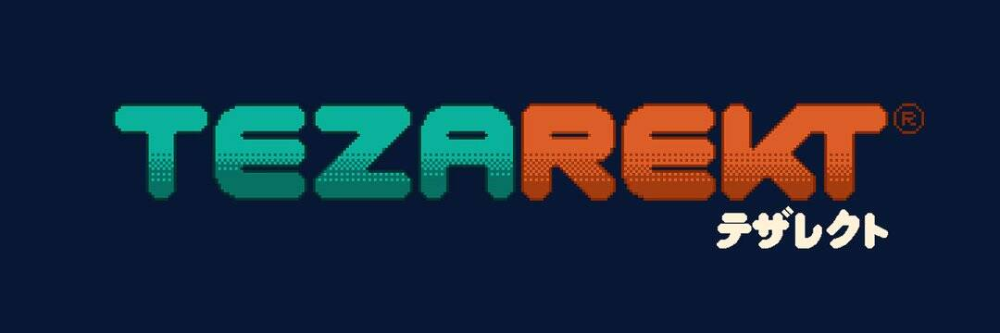

# Tezarekt

Tezarekt 是一种跨平台的数字自动售货机，可唤起新的社交体验。我们的目标是通过为社区、品牌和艺术家创建定制项目来赋予他们权力。
对于 web 3.0 用户，我们集成了一个游戏化的 NFT 市场，通过融合街机、拼图和扭蛋的叙事，打破了传统 NFT 收藏的界限。另一方面，我们与实体业务和现场活动合作，为非加密观众带来 Tezarekt 体验。 Tezarekt 的核心元素是扭蛋系统，最初是自动售货机，在胶囊中分发随机玩具，买家在购买时才知道他们收到了什么。这为买家增加了一定程度的兴奋，因为每个系列都包含按稀有程度分类的产品 - 常见于超稀有，他们可能会获得比他们支付的价值更高的物品。在我们的一种扭蛋模式中，我们还提供拼图模式，收藏家可以购买随机的 NFT 碎片，这些碎片可以组合并交换成完整的碎片。这些零散的片段包含该特定系列的完整 NFT 独有的视觉和/或听觉元素。

