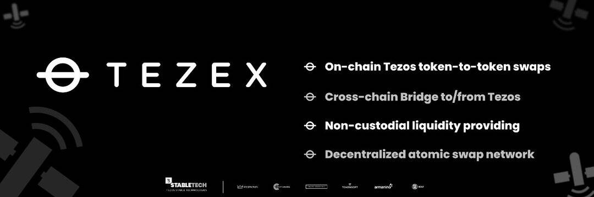

# TEZEX

TEZEX 是一个 Tezos 流动性交易所，通过链间和链内代币交易扩大流动性。 TEZEX Bridge 支持 Tezos 代币与其他区块链（如以太坊）的代币之间的跨链代币交换——也就是说，以太坊 ERC 标准代币（例如 ERC-20）可以交换为 Tezos FA 标准代币（例如 FA-1.2、FA- 2.0）。

2022 年 TEZEX 的未来进展：BSC-Tezos 集成（以太坊气体解决方法）BTC Taproot 集成（比特币-Tezos 互换）Changemaker 桌面应用程序，便于流动性/收益管理变革者选择自己的费用交易者限价单

