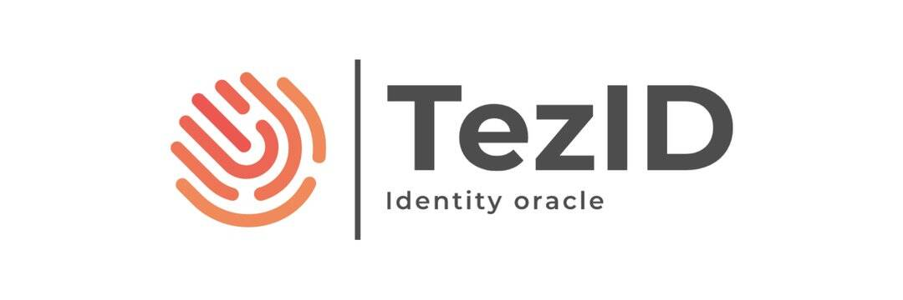

# TezID

TezID 的核心是一个智能合约，每个地址都有注册地址和经过验证的证明。 用户可以注册他/她的地址和不同的证明，并使用预言机来验证这些证明。
流量：

   用户将他们的钱包连接到 TezID dapp
   用户使用 TezID 智能合约注册他们的地址
   用户使用 TezID 智能合约注册支持的证明之一
   用户向预言机请求验证码
   预言机验证属性的唯一性（您不能两次注册相同的电子邮件）
   预言机向物业发送验证码
   用户收到验证码并输入到 TezID dapp
   预言机在智能合约中将证明标记为已验证

它可以从其他智能合约中用于验证 Tezos 地址是否与真人相关联。

