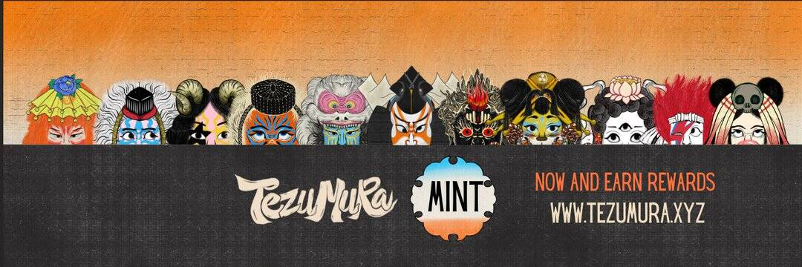

# Tezumura Japanese Art Collectible

Tezumura：在 Tezos NFT 上介绍正宗的日本艺术收藏品
日本艺术是一种文化的表达，它吸引了来自世界各地的人们。许多传统艺术家使用武士、艺伎、忍者和妖怪等流行人物来讲述他们的故事。
然而，找到真正的日本艺术风格变得越来越少，包括 Tezos NFT。
浮世绘的手村是什么？
Sarisa Kojima 是 Kojima Project 的负责人，向人们介绍了“浮世诗”的浮动世界。 Tezumura 是代表日本古代 Tezos 社区村民的 5,555 个 FA2 代币的集合。
浮世是一个用来描述城市生活方式和文化的词，尤其是日本江户时代的享乐方面。
“浮世”一词在写作时意为“漂浮的世界”，也是对早期佛教单词浮世（忧き世，“悲伤的世界”）的讽刺和谐音暗示，指的是死亡和重生的尘世平面佛教徒寻求释放。
关于团队
作为专门从事日本版画和绘画的艺术家，小岛亲自绘制了所有 555 层作为该系列的 12 个属性。 Kojima 还是 SweatyNFT 的艺术家和联合创始人，这是一个用于 Tezos NFT 图像生成和智能合约部署和管理的无代码工具集。
关于收藏
Tezumura 将于 2022 年 4 月 13 日推出 5,555 件独特的艺术品和 5 个手绘稀有代币。该系列包括按其在社区中的角色分类的各种角色、工匠、商人、旅行者、勇士等。
该系列力求成为在 Tezos 区块链上发布的最具艺术性和合格性的日本艺术收藏品。

