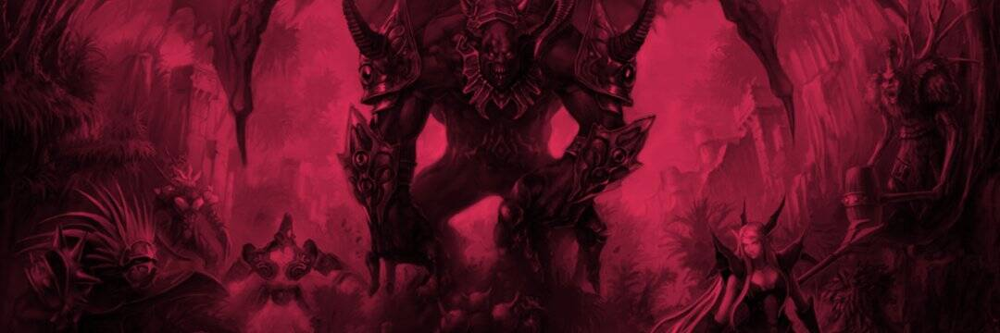

# Tharos Networks

我们是 Tharos Networks：独一无二的多元宇宙
Tharos Networks 是一个基于 BSC 区块链的多元宇宙，可让您以前所未有的方式沉浸在游戏世界中。
视频游戏行业是一个价值数十亿美元的行业，游戏玩家投资但很少（如果有的话）看到他们的投资回报。我们知道，社区中创造力的真正价值被低估了，将时间和想象力投入到游戏中的玩家并没有得到足够的回报。
Tharos Networks 多元宇宙将由社区驱动，这意味着玩家、开发商和投资者将决定可持续生态系统中基础项目、角色和资源的价值演变。
Tharos Networks 发展过程中产生的大部分收入将返还给社区，以促进可持续经济，推动 Tharos Networks 价值的持续增长，从而进一步发展社区。
游戏中的角色、物品和资源可以在一个充满无限可能性的世界中购买、混合、丢弃和出售。
经济系统由一个可持续的系统驱动，该系统由以下部分组成：

  THN：治理代币。
  DRG：游戏卡。可以通过购买THN代币获得。
  USDT：用于在市场上购买和出售物品、人物和资源。
  GP：它是根据连续玩的时间来赚取的。它用于在游戏中购买较低类别的物品。

这甚至不是我们带给您的全部……我们邀请您查看我们的白皮书并发现即将到来的一切。

