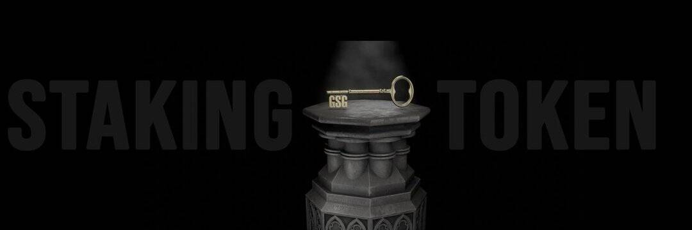

# The 80/20

此代币的持有者在推荐他人和与合约互动时会收取股息、奖金和佣金。
80/20 于 2020 年 10 月首次在以太坊网络上推出，已处理超过 1000 个 ETH。 然而，由于高昂的汽油费，该团队决定试一试 Smart Chain。 新的 80/20 已于 2021 年 2 月 27 日部署，目前正在管理 427 个 BNB。
GS50 代币流通和总供应量目前为 281,659 GS50
GS50 还可用于购买当前在网站上提供的 NFT 收藏品。 NFT 是 ERC-1155 标准并交付给您的加密钱包，但由于 BSCScan 尚未识别此格式，因此只能在 80/20 网站上看到该令牌。
白皮书和社交关系都在 https://www.the8020.io

