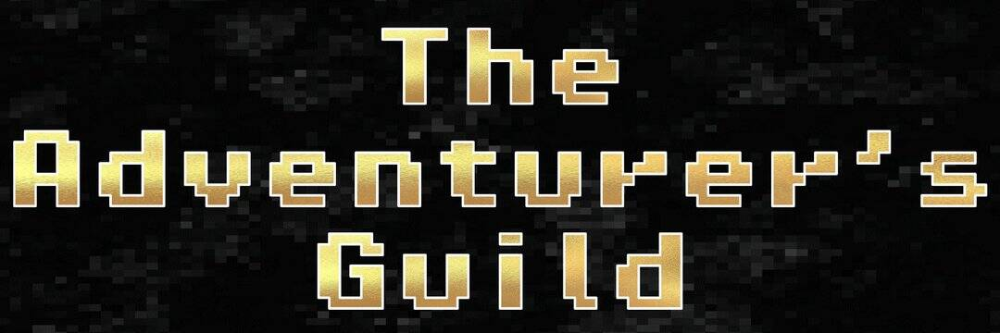

# The Adventurer's Guild

目前处于开发阶段的冒险家公会是一款基于 NFT 的角色扮演游戏。您可以创建一个角色，为他们装备上装备，并开始从地牢爬行到与强大的 Boss 战斗的各种任务，所有这些都来自 Discord！
踏上不同的任务以取得荣耀！

  动态头像：在您装备的装备中看到您的角色！
  可定制的构建：可装备的 NFT 将能够升级，每个级别都会添加独特的奖励。拥有10个装备槽和5个技能槽，这意味着装备和技能的组合几乎是无穷无尽的。
  奖励收藏家：几乎所有 WAX NFT 都可以在冒险家公会中使用。您最多可以为您的角色装备 21 个非 TAG NFT，以获得额外奖励。
  战利品铸币到你的钱包！ - 每次你完成一个任务，你都会得到一个包含你的战利品的包，直接发送到 WAX 钱包！你会试试运气并打开它还是在市场上翻转它？这是你的选择！
  赚取公会！您可以在冒险家公会内将其用于各种目的，或在 Alcor 上交易！

