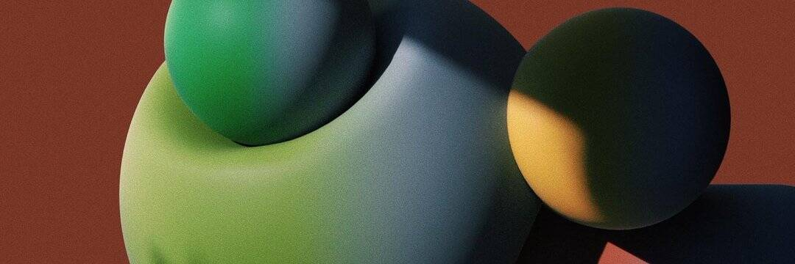

# the#boi

#boi 系列是一系列独特的雕刻收藏头像。 最初的#boi 是#mother 和艺术家LIŔONA 在VR 中的梦想。 每个都代表了元宇宙中无性别生物的不同原型。

#boi 系列是一系列 100 个独特的雕刻收藏头像。 最初的#boi 是#mother 和艺术家LIŔONA 在VR 中的梦想。 每个都代表了元宇宙中无性别生物的不同原型。 大多数#boiz 是 1/1，而其他的则是版本。 总共只有 1000 个#nfts。

#boi 是什么？
#boi 系列是一系列独特的雕刻收藏头像。 最初的#boi 是#mother 和艺术家LIŔONA 在VR 中的梦想。 每个都代表了元宇宙中无性别生物的不同原型。

