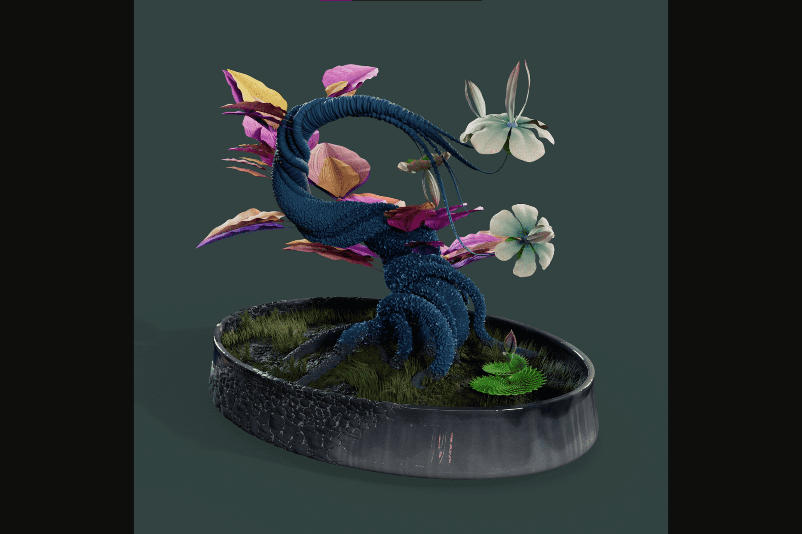

# The Evolving Forest

该系列代表 9,336 株神圣的创世纪树苗。公开发售结束后，种子将揭晓。
10 月 15 日将举行神圣的移植仪式，种子将变成美丽独特的树苗，具有不同的特征和稀有度。
谨防诈骗收集并加入我们的 Discord！本种植和栽培指南按季节划分。它列出了森林形成的顺序，以及园丁在启蒙之路上应该期待什么。神圣的种子将在他们前往古一洞穴朝圣后由贤者播下。在她的默许下，园丁们将聚集在小树林中建立友谊纽带。种子将从长期沉睡中醒来。公会将选择土壤补丁，并开始启迪未觉醒者接受远古者之光的任务。带着巨大的喜悦和散发出的 pscillion 碎片所充满的能量，现场供养将开始。土壤评估和肥料蒸馏将预示着神圣的移栽仪式。最后的生长周期将在水晶月亮的收获中达到高潮。将举行祭祀仪式，为圣地重新播种。生态系统成长阶段“阿尔法”最终将开始。

