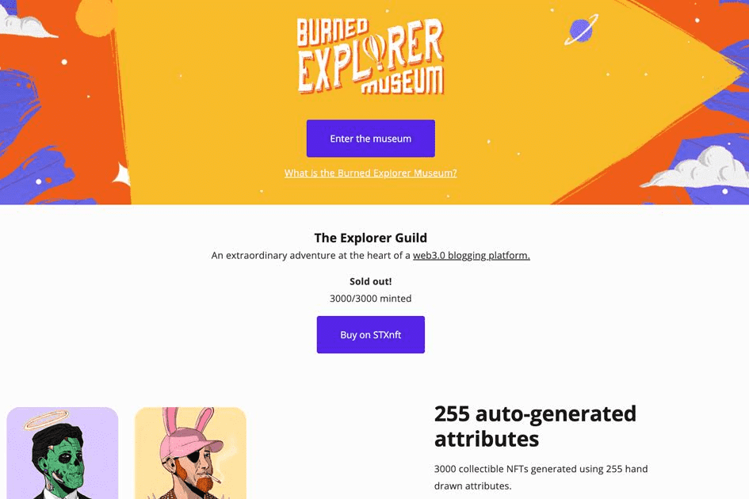

# The Explorer Guild

使用 255 个手绘属性生成 3000 个可收藏的 NFT。
该系列的灵感来自 200 年前的法国科幻作家儒勒·凡尔纳。他的故事在当时是未来主义的，他的许多工作包括环游世界和更远的地方。对他来说，写作是一种探索形式，我们认为对于 Sigle 用户来说也是如此。探险者有着不同的过去、不同的议程和不同的想法，但他们来到 Sigle 开始了与世界分享他们想法的旅程。
通过购买 EXPLORER，您将参与通过 NFT 销售为 Web 3.0 公司提供资金的革命性时刻。您持有的资源管理器将使您能够访问 Sigle 已着手构建的高级功能。可编程时事通讯、深入分析、自定义域等等。
我们的平台开发将由社区资助，我们的目标是打造最适合您的东西，而不是最适合公司的东西。

