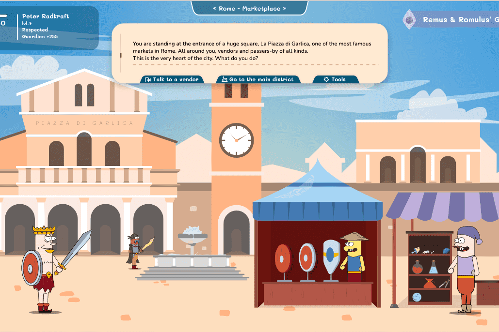

# The Garlies

您是否曾梦想找到圣杯或发现神秘的亚特兰蒂斯城？
好吧，在 The Garlies 中，您可以同时做更多的事情！
Garlies 是在臭名昭著的发现时代的角色扮演游戏。
Garlies 必须完成任务以获得战利品、金钱和声望，才能成为有史以来最伟大的 Garlie！
任务系统的灵感来自角色扮演游戏书。这意味着：一个故事=几十个选择=几十个可能性=几十个结局。Garlies 是生活在大航海时代（15-16 世纪）的冒险家。他们完成世界各地的任务以赚取战利品、声望和金钱！

