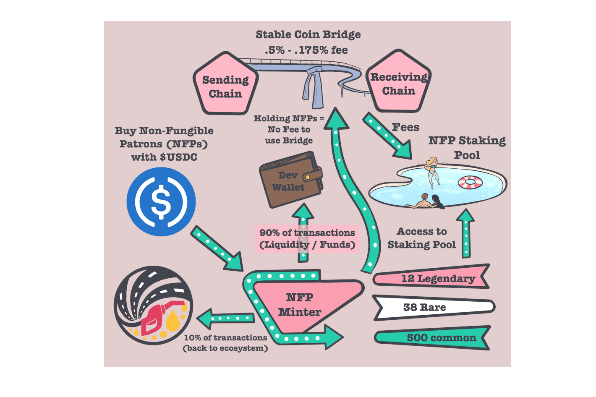

# The Gas Station

加油站的目标是成为去中心化金融（DeFi）空间中所有协议中领先的利润分享平台。我们的超通缩股息代币向我们的代币持有者奖励以太（gas），并允许他们访问诸如加油（质押）和桥接（免税）等服务。 Non-Fungible Patrons 是可收藏资产，有助于为生态系统产生大部分资金，并允许收藏者在未来几年从他们的收藏品中赚取利息。加油站将所有开发税的 100% 返还给生态系统，让投资者无论决定进入哪个阶段都可以获得惊人的回报。

