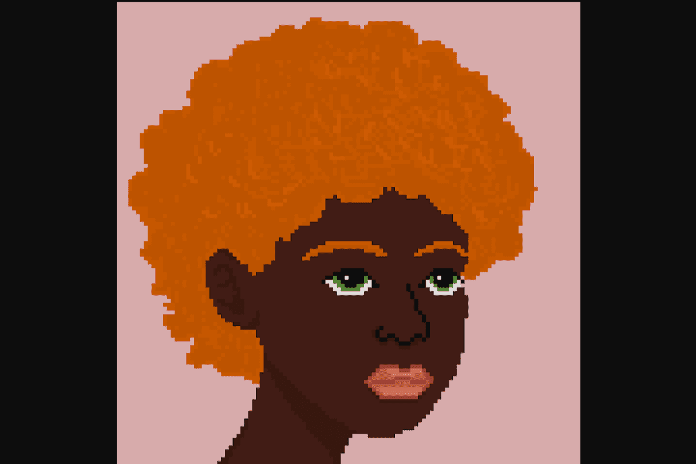

# The Glitches NFT

The Glitches 是一个包含 5,000 个随机生成的人类头像 NFT 的项目。这是一个以人类特征为中心的项目，并且非常注重多样性。我们专注于以较低的入门成本交付高质量的项目。没有官方路线图，但这是一个长期的游戏，所以我们已经在研究一些想法！主要用途是独特而多样的艺术以及包容的社区！这将是一个免费的公共铸币厂（只需支付汽油费），但您可以选择在 24 小时铸币期内的任何时间购买一张 0.02 铸币的铸币通行证。

