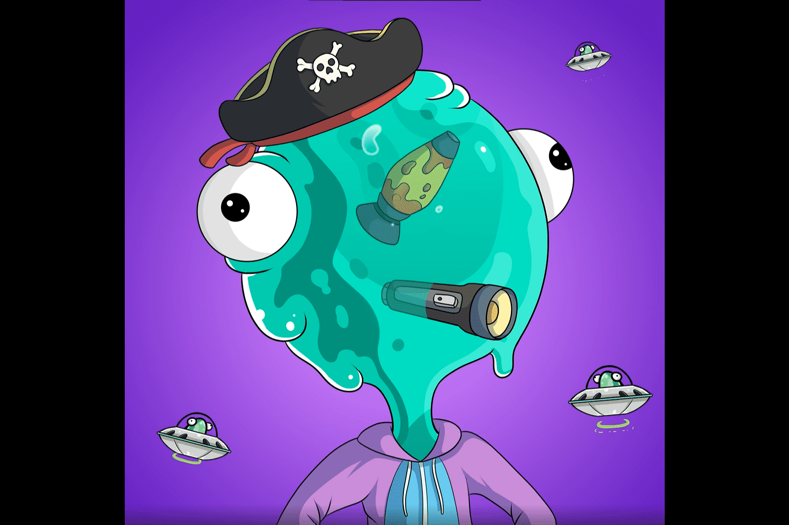

# The Goobers

Goobers 是 15,000 个完全独特且随机的 NFT 的集合，提供并存储在以太坊区块链上。每个 Goober 都有许多配饰、服装、动画以及他们声称的大脑！价值数万亿美元的公司 ChemiCo，为肮脏的富人生产高端洗发水，梦想为他们的客户制作完美的配方混合物。经过多年的死胡同研究和不断将生物废物倾倒到附近的供水系统中，被丢弃的废物开始变异并形成称为 Goobers 的粘液状生物。

