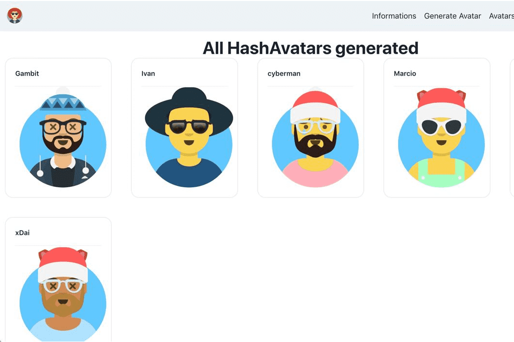

# The Hash Avatars

Hash Avatars 允许任何人从任何哈希名称中将 Avatars 铸造为 NFT，它建立在 xDai 链上，一个安全、廉价和快速的以太坊侧链。
写点东西，算法会自动生成头像。分身的总数限制与地球人口一样，70亿，所以每个人只有1个分身。
索取您喜欢的哈希头像并立即开始您的收藏！在过去的几个月里，我们看到了一大堆关于 Metaverse 的承诺，同时这很令人兴奋，不得不等待太无聊了，大多数项目还没有交付，甚至还没有演示版本。那是全面的，先进的技术需要时间，而且永远不会完成，发展是不断的。

