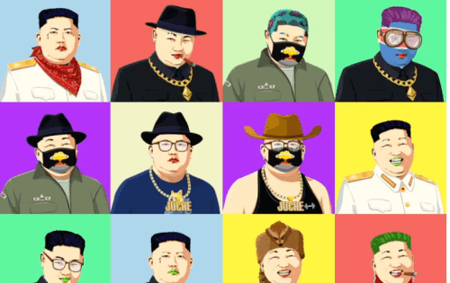

# The Kimmies

Kimmies 旨在取笑朝鲜政权，为英国领主头衔提供一个古怪的替代方案，并通过允许任何人通过 Paypal 购买 NFT 来让人们进入 Web3 的世界。每个 NFT 都包含一个图像和一个（真实的）朝鲜领导人头衔，您可以在我们的网站上为此生成一个头衔证书。
Kimmies 是 666 个 NFT 的有限集合，其中包括最高领袖的形象以及他的一个官方头衔。随着项目的发展，NFT 持有者还将获得额外的福利和活动、商品以及我们的专属俱乐部 Kimdom 的独家使用权。

