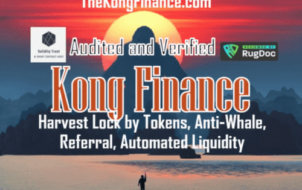

# The Kong Finance

香港金融：
币安智能链上的自动化流动性安全收益农场。
特点和功能：

  通证锁仓（新）通过：

一种新实施的 Harvest Lockup 机制，其中的锁定时间基于收获的代币与通常时间相比。

  自动流动性：

在每次的转让将收取 5% 的税费。 2% 将被发送到死地址并被烧毁，而且最后 3% 将用于创造流动性。

  推荐费：

使用推荐链接的 5% 推荐费。

  反鲸：

每笔交易最多占 Kong 总供应量的 2%，

