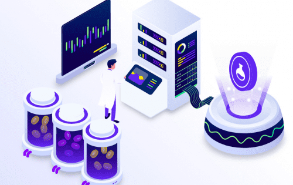

# The Lab Finance (LABO)

## 什么是实验室财务？
Lab Finance (LABO) 是一个以社区为中心的农业解决方案，具有治理和产生利润的 NFT，具有时间锁定合同。随着新代币的铸造和分发作为奖励，供应量不断增加。它于 2021 年 4 月 1 日推出。
### 农场和游泳池
Lab Finance 在启动时提供 11 个池和 11 个农场，这些池和农场通过 LABO 支付产生的收益回报。在平台上的股权选择包括流行的代币和 LP 代币。由于流动性提供者面临永久损失的风险，APY 获得的抵押 LP 代币高于抵押单一资产代币。一旦 NFT 模型上线，农业协议将在持有者之间共享存款和铸币费。
### NFT 盈利模式
通过我们的 NFT 模型，50 名持有者将累积 3% 的存款费用和 60% 的开发者铸造费用。这种独特的机制将增加平台的去中心化，让更多的持有者有机会获得额外的奖励。
### 安全与审计
该平台已通过 Unicrypt 官方审计合作伙伴 Solid Group 的审计。 Masterchef 合约还有一个 24 小时的时间锁，这增加了平台的安全性

