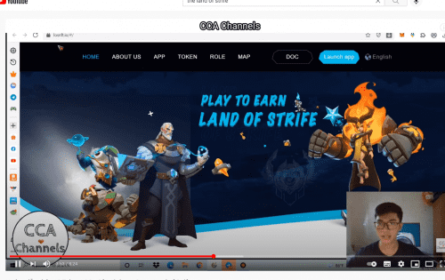

# The Land Of Strife

Strife 的玩家可以通过 PVE 的战斗模式获得大量的资产和代币，然后在游戏中获得巨大的收益和代币。或者出售）可以促成自己的英雄市场交易部分。
Land of Strife 通过“玩赚钱”的经济模式将玩家和游戏紧密结合在一起。在《纷争之地》中，玩家可以通过 PVE 战斗模式获得大量收益（例如游戏中可以在公开市场上公开出售的资产和代币），或者通过培养自己的英雄获得被动收入。

