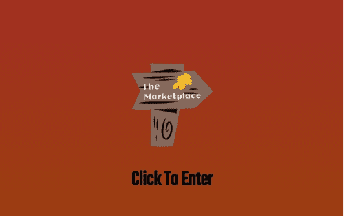

# The Marketplace

Marketplace 是 Harmony 网络上所有生成 NFT 的 NFT 市场。任何 ERC-721 代币都可以在市场上上市。您可以在所有 NFT 上出售、购买、拍卖和出价。 Marketplace 是 Harmony 上第一个持有所有 ERC-721 代币的平台，而以前您必须依靠本地市场进行无需信任的购买和销售。用户能够为所有销售设置 0-50% 的版税。
The Marketplace 上还有一个彩票系统。用户可以购买他们想要的任何数量的门票，以期赢得大奖。
市场由 Bard guild 代币支持以进行治理。

