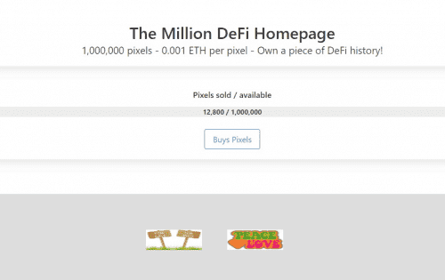

# The Million DeFi Homepage

百万#DeFi 主页 - 拥有一段#DeFi 历史！ ✅
购买你的像素。做广告或出租它们。💸Million 是一种加密货币，总代币供应量有限，为 1,000,000 个，每个代币的最低价值为 1.00 USDC。没有上限。

🌕 The Web 3.0 memecoin（“丛林狗币之王”）

完全支持 Web 3.0，Million 是一种利用现代技术的多链加密货币。与第一代 memecoin（如 Dogecoin 或 Shiba）不同，Million 支持智能合约、DeFi、staking、DAO、Proof-of-Stake 高可扩展性和元界的快速交易。

💸去中心化金融

Million 通过 Million Pool 支持 DeFi，包括用于利益相关者权利的去中心化治理 DAO。

✅ 透明与信任

100% 透明，代码完全由 Certik 审核。每个代币都授予利益相关者在社区治理 DAO 中的权利。

🦁 成为百万分之一。

