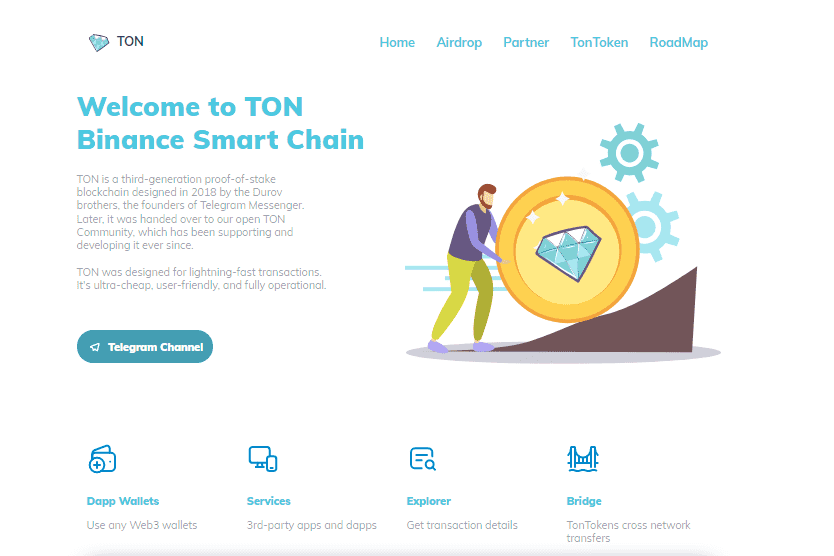

# The Open Network

TON 是第三代权益证明区块链，由 Telegram Messenger 的创始人 Durov 兄弟于 2018 年设计。后来，它被移交给我们开放的 TON 社区，该社区一直在支持和开发它。
TON 专为闪电般的交易而设计。它超便宜、用户友好且完全可操作。TON 是第三代权益证明区块链，由 Telegram Messenger 的创始人 Durov 兄弟于 2018 年设计。后来，它被移交给我们开放的 TON 社区，该社区一直在支持和开发它。TON 专为闪电般的交易而设计。它超便宜、用户友好且完全可操作。

