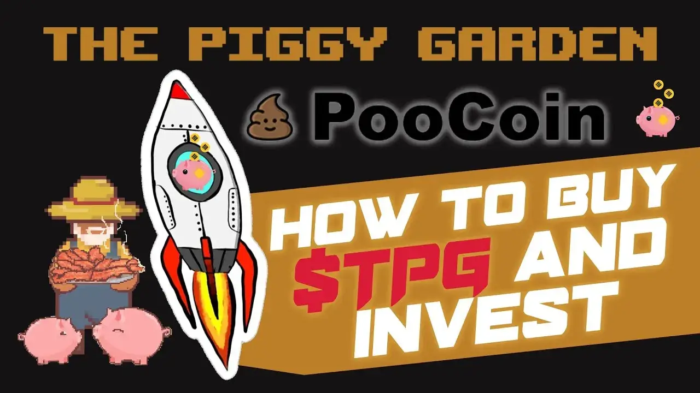

# The Piggy Garden

继《存钱罐机器》大获成功后，《老麦当劳》是小猪天堂的第二款 Defi 游戏。老麦当劳是“花园”著名的“渔夫乔”游戏的一个分支。
老麦克唐纳有一个农场，E-I-E-I-O，但房地产奖励迫使他搬迁到他的新花园。在这个花园里，他想养一大群小猪来吃美味的培根。老麦当劳饲养的每头猪都能产出美味的培根，可以以 TPG 的价格出售。一旦你养了一只小猪，它会越来越胖，并为你带来每日培根的被动收入。您收到的培根可用于饲养更多小猪并增加您的收入或出售。

