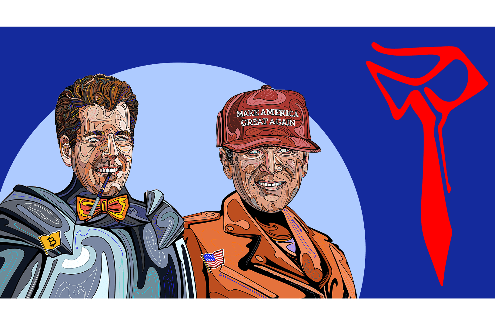

# The Presidents

《总统大人》是在币安智能链上推出的独一无二的 NFT 和 GameFi 独家合集，包含 20,000 件杰作。现在可以从市场上铸造总统 NFT。
该系列共有8种总统专属头像，分别是世界（13070张）、世界传奇（2408张）、美国（3734张）、美国传奇（453张）、苏联（285张）、加密（39张）、秘密（10张）、和中本聪（1）。某一类总统越少，就越稀有。
该系列以美国、欧洲、亚洲、拉丁美洲和苏联的著名总统为特色，他们对我们今天生活的世界产生了重大影响。他们包括特朗普、奥巴马、斯大林、丘吉尔等等。同样，大型、知名和知名的加密货币和区块链组织的总裁，如 Binance、Ethereum 和 TRON 也有特色。该系列共有 50 位不同的总统。
每个 NFT 都有自己的设计，并且是任何现有区块链上的一种。通过使用人工智能，NFT 被分配了 246 个特征，因此每张肖像都有自己的独家设计。这个收藏将永远留在数字艺术和 NFT 的历史上。
使用流行的 Metamask 钱包可以为 0.3 币安币 (BNB) 铸造一位总统。
总统市场将在 20% 的总统被铸造后开放，允许用户购买、出售和交易他们的总统。
一旦平台上推出“斗志之战”游戏，将赢得首场比赛的玩家将获得25万美元的奖金。
随机选择了 100 个总统 NFT，以接受比铸币价格高出 10 倍的出价。欲了解更多信息，请访问 https://presidents-nft.com

